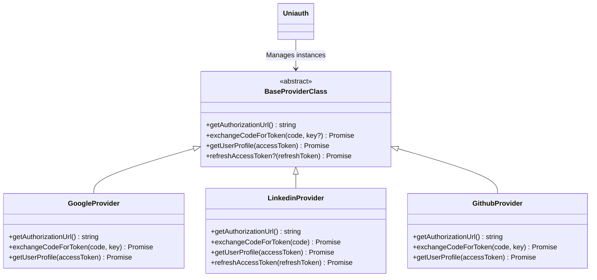
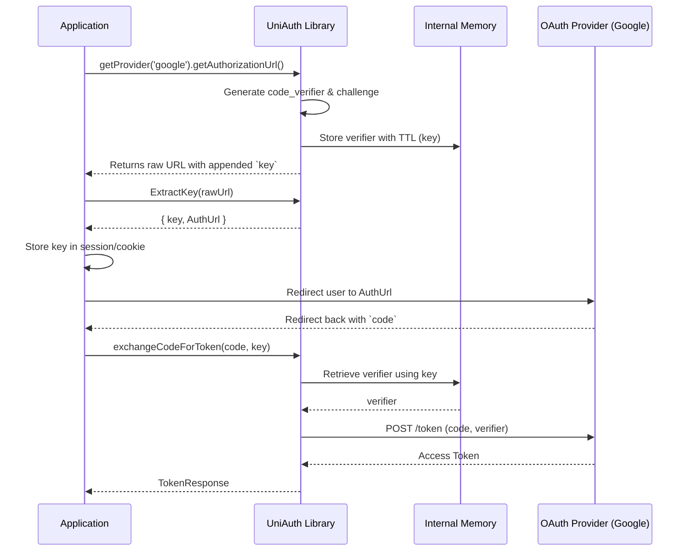

# Architecture

UniAuth is designed with a clear separation of concerns, providing a unified interface across disparate OAuth implementations.

## Class Hierarchy

## Request Flow (PKCE Example: Google/GitHub)

## Provider Abstraction Pattern

The `BaseProviderClass` guarantees that regardless of the underlying OAuth 2.0 or OIDC implementation details, the application developer interacts with the exact same method signatures.

## PKCE Memory Management

For flows requiring PKCE, a challenge is generated dynamically per request. Since UniAuth doesn't manage HTTP sessions, it stores the raw `code_verifier` in an internal Node.js memory map, indexed by a short-lived UUID (`key`). The developer bridges the gap by persisting this lightweight `key` in the user's session between the redirect and callback phases.
