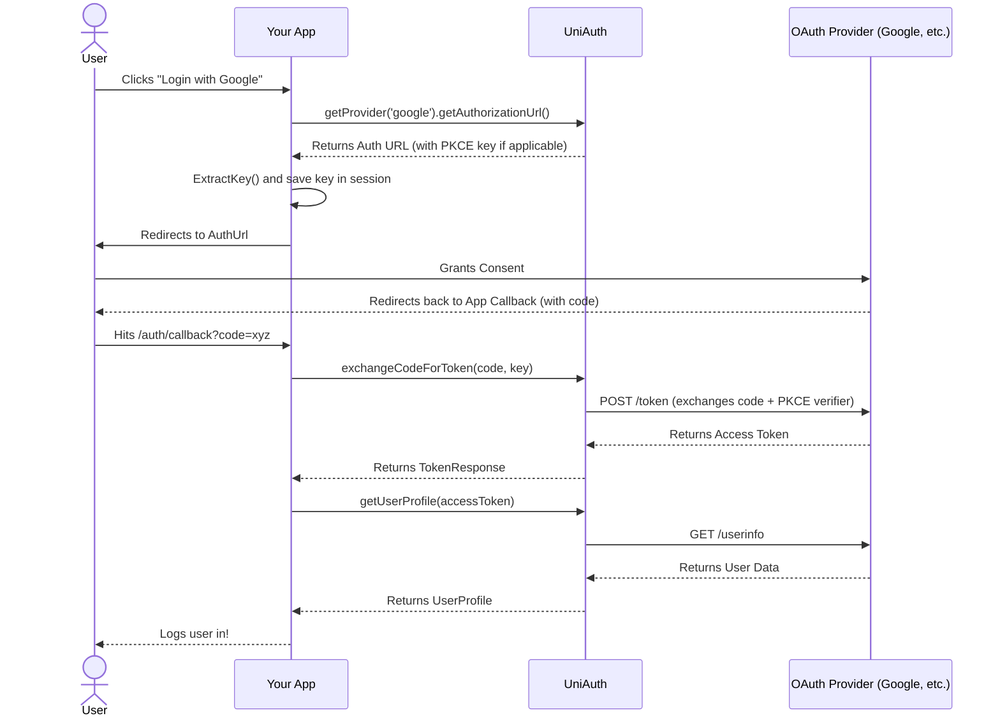

# OAuth 2.0 Flow

UniAuth abstracts away the complexities of the OAuth 2.0 Authorization Code Flow.

## Sequence Diagram

Here is a visual representation of the complete flow when using UniAuth:

## How UniAuth Abstracts This
Instead of manually crafting URLs, tracking `state` parameters, handling PKCE hashing, and making nested HTTP requests to various endpoints, UniAuth provides a streamlined, type-safe API. 

## PKCE vs Non-PKCE Flows
- **PKCE Flows (Google, GitHub)**: You use `ExtractKey(url)` to securely separate the `key` pointing to the in-memory code verifier from the actual redirect URL.
- **Non-PKCE Flows (LinkedIn)**: You use the generated URL directly. The `getAuthorizationUrl()` method handles setting the `state` parameter automatically to prevent CSRF attacks.

## State Parameter Handling
For non-PKCE providers like LinkedIn, UniAuth embeds the state parameter logic internally. For PKCE providers, the robust PKCE challenge mitigates similar CSRF vectors.
