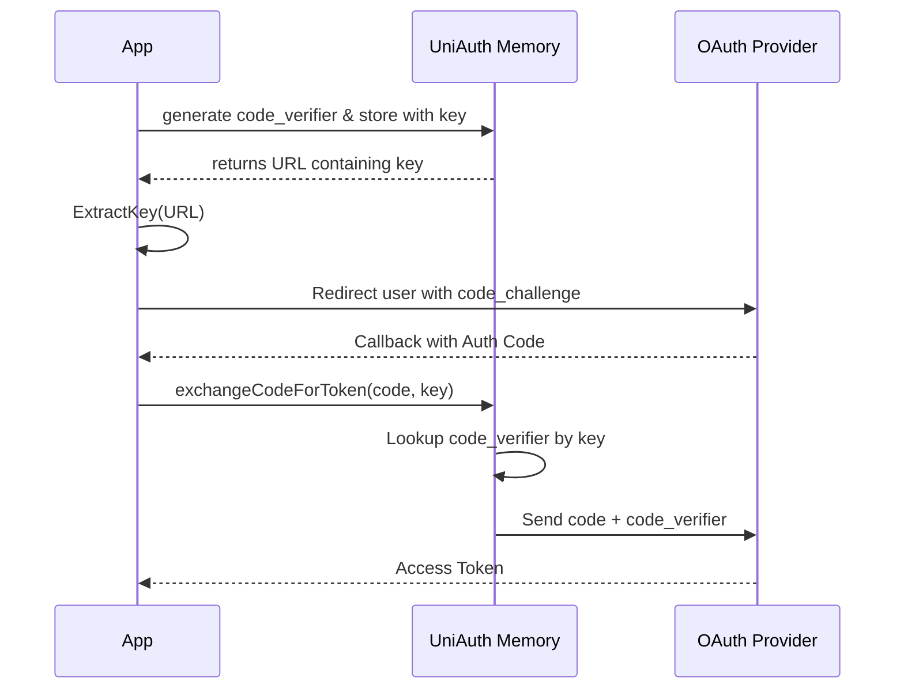

# Proof Key for Code Exchange (PKCE)

## What is PKCE?
Proof Key for Code Exchange (PKCE, pronounced "pixy") is an extension to the OAuth 2.0 Authorization Code flow. It prevents malicious attackers from intercepting the `code` and exchanging it for an access token. 

## How UniAuth Implements PKCE

For supported providers (Google, GitHub), UniAuth handles PKCE automatically through an in-memory storage system:

1. **Generation**: `generateCodeVerifier()` creates a random cryptographically secure string.
2. **Hashing**: `generateCodeChallenge()` creates a SHA-256 hash of the verifier.
3. **Storage**: The verifier is temporarily stored in memory with a unique `key`.
4. **Extraction**: The developer calls `ExtractKey(url)` to get the `key` and the clean `AuthUrl`.
5. **Exchange**: During the callback, the developer passes the `key` back into `exchangeCodeForToken()`. UniAuth retrieves the original verifier from memory and sends it to the provider.

## Flow Diagram



## Which Providers use PKCE?
In UniAuth, **Google** and **GitHub** utilize the PKCE flow. **LinkedIn** uses the standard authorization code flow.

## Memory Management and TTL
The in-memory storage for PKCE verifiers is defined by the `useMemoryType` structure:
```typescript
type useMemoryType = {
  key: string;
  value: string;
  ttl: number; // in milliseconds
}
```
**Important**: The TTL (Time-To-Live) for a PKCE key is strictly **60 seconds**. If the user takes longer than a minute to grant consent and return to your application, the session will expire, and an error (`Session expired or invalid key`) will be thrown during token exchange.
