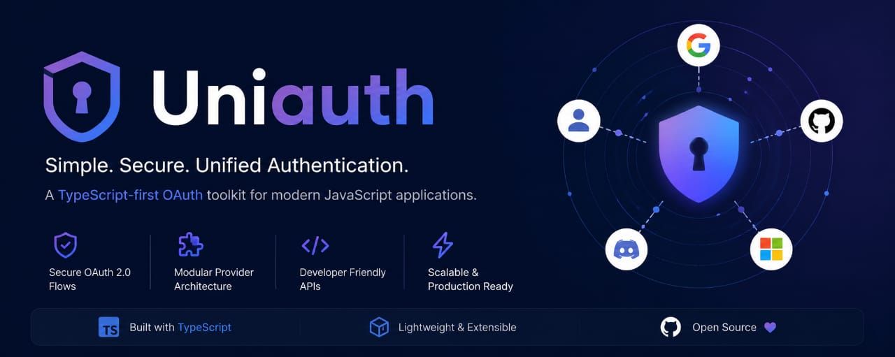
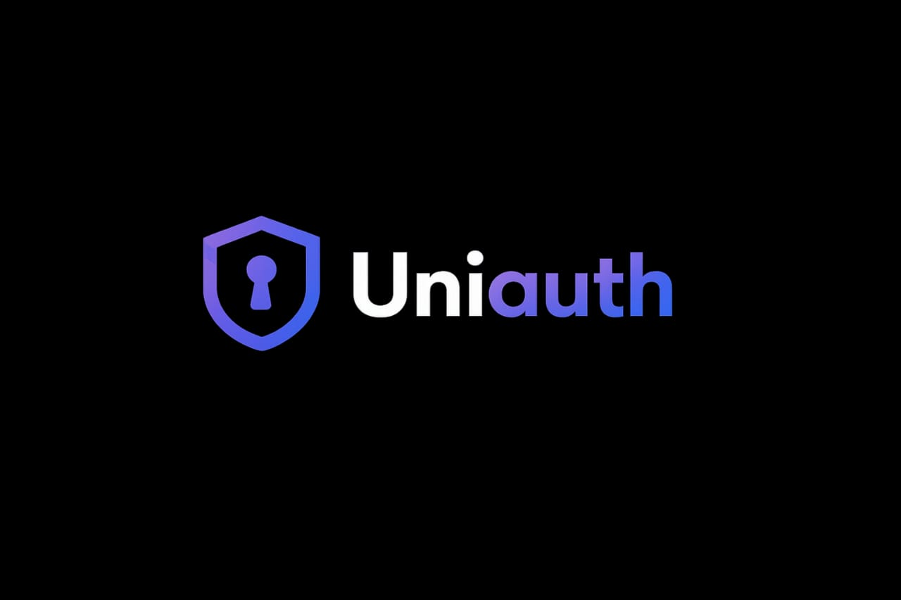
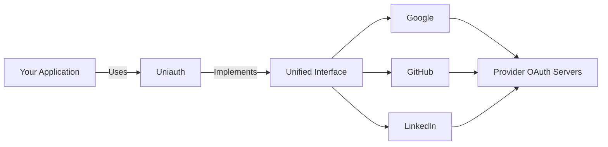
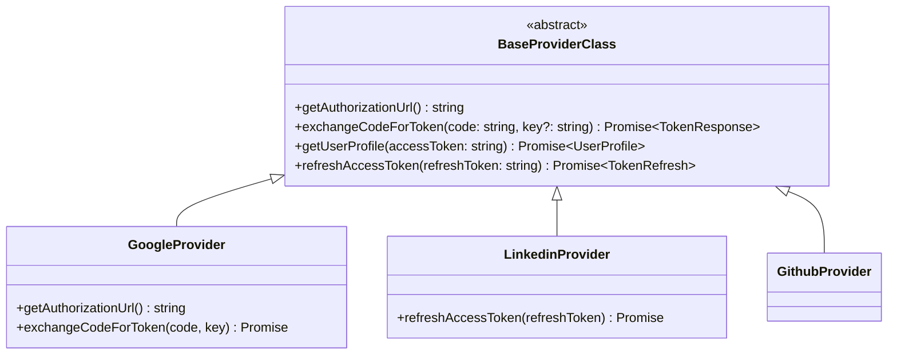
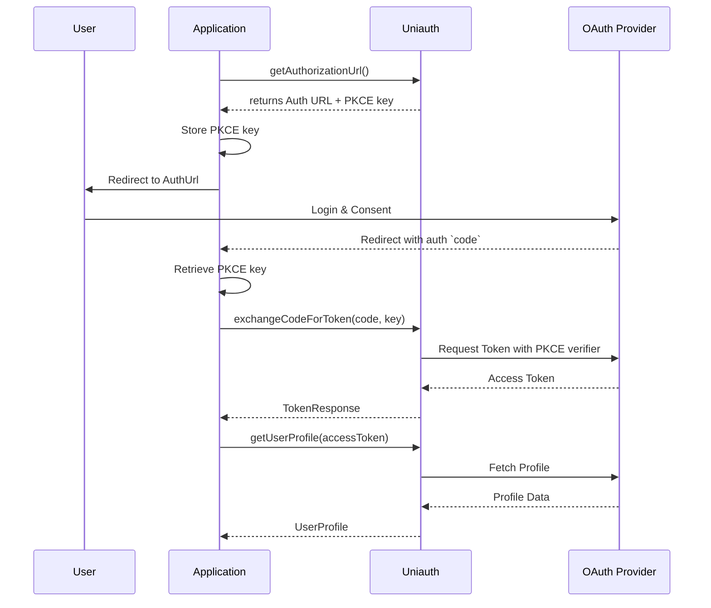

<p align="center">
  
</p>

# Uniauth 🔐

> Unified OAuth authentication toolkit for modern JavaScript applications.

<p align="center">
  
</p>

<p align="center">
  
  
  
  
  
</p>

## Introduction

`Uniauth` is a TypeScript-first OAuth wrapper library designed for modern JavaScript and TypeScript applications. It provides a unified provider interface so you can integrate multiple OAuth providers without rewriting authentication logic for every platform. By standardizing the OAuth flows—including PKCE and Token Refresh—Uniauth enables developers to easily implement secure authentication without provider lock-in.

## Why UniAuth

Most OAuth libraries force developers into provider-specific logic, inconsistent APIs, or framework lock-in. Uniauth solves this by offering:

- **Unified Interface**: Write authentication logic once and switch providers easily.
- **Built-in PKCE**: Native support for modern, secure PKCE flows without external utilities.
- **TypeScript First**: Full type safety and intelligent autocomplete out of the box.
- **Framework Agnostic**: Works perfectly in any Node.js backend (Express, Fastify, NestJS, Next.js, etc.).

### Comparison

| Feature | Uniauth | Passport.js |
|---|---|---|
| **Unified API** | ✅ | ❌ |
| **TypeScript-first** | ✅ | ⚠️ Partial |
| **Lightweight Setup** | ✅ | ❌ |
| **Consistent Flow** | ✅ | ❌ |
| **Framework Agnostic** | ✅ | ⚠️ |
| **Built-in PKCE** | ✅ | ❌ |

## ✨ Features

- 🔐 **Unified OAuth API**: Identical interface for all supported providers.
- 🔑 **PKCE-ready**: Built-in support for secure Proof Key for Code Exchange flows.
- 🧠 **TypeScript-first**: Comprehensive type definitions included.
- 🔄 **Token Refresh**: Easy-to-use methods for refreshing access tokens.
- ⚡ **Lightweight**: Zero unnecessary dependencies and framework lock-in.
- 📦 **Minimal Setup**: Get started in just a few lines of code.

## 📦 Installation

Ensure your environment meets the requirement of **Node.js >= 20**.

### npm
```bash
npm install @deba_1307/uniauth
```

### pnpm
```bash
pnpm add @deba_1307/uniauth
```

### yarn
```bash
yarn add @deba_1307/uniauth
```

## 🚀 Quick Start

Here is a minimal working example demonstrating the Google OAuth flow with PKCE:

```ts
import Uniauth, { ExtractKey } from '@deba_1307/uniauth';

const auth = new Uniauth({
  providers: {
    google: {
      clientId: 'YOUR_CLIENT_ID',
      clientSecret: 'YOUR_CLIENT_SECRET',
      redirecturl: 'http://localhost:3000/auth/google/callback',
      scope: ['openid', 'email', 'profile']
    }
  }
});

const google = auth.getProvider('google');

// 1. Generate auth URL and extract the PKCE key
const { key, AuthUrl } = ExtractKey(google.getAuthorizationUrl());
// Save `key` to your session/database

// 2. Redirect user to `AuthUrl`

// 3. After callback, exchange code for token using the saved key
const token = await google.exchangeCodeForToken(code, key);

// 4. Fetch the user profile
const profile = await google.getUserProfile(token.accessToken);
```

## Supported Providers

| Provider | Status | PKCE | Refresh Token |
|---|---|---|---|
| **Google** | ✅ Implemented | ✅ PKCE | ❌ No refresh |
| **GitHub** | ✅ Implemented | ✅ PKCE | ❌ No refresh |
| **LinkedIn** | ✅ Implemented | ❌ No PKCE | ✅ Refresh support |
| **Discord** | 🔜 Planned | - | - |
| **Spotify** | 🔜 Planned | - | - |

## Provider Examples

### Google (PKCE)

```ts
const google = auth.getProvider('google');

// Generate Auth URL
const { key, AuthUrl } = ExtractKey(google.getAuthorizationUrl());
// Save key, redirect to AuthUrl...

// Handle Callback
const token = await google.exchangeCodeForToken(code, key);
const user = await google.getUserProfile(token.accessToken);
```

### GitHub (PKCE)

```ts
const github = auth.getProvider('github');

// Generate Auth URL
const { key, AuthUrl } = ExtractKey(github.getAuthorizationUrl());
// Save key, redirect to AuthUrl...

// Handle Callback
const token = await github.exchangeCodeForToken(code, key);
const user = await github.getUserProfile(token.accessToken);
```

### LinkedIn (Standard OAuth)

LinkedIn does not require PKCE, so you don't need to use `ExtractKey` or pass a key during the token exchange.

```ts
const linkedin = auth.getProvider('linkedin');

// Generate Auth URL
const authUrl = linkedin.getAuthorizationUrl();
// Redirect to authUrl...

// Handle Callback
const token = await linkedin.exchangeCodeForToken(code);
const user = await linkedin.getUserProfile(token.accessToken);
```

## Architecture Overview



### Class Hierarchy


## OAuth Flow

Here is the standard PKCE flow used by Google and GitHub:



## API Reference

| API Element | Description |
|---|---|
| `Uniauth` | Main class to initialize providers. |
| `getProvider(name)` | Retrieves a provider instance (case-insensitive). |
| `getAuthorizationUrl()` | Generates the provider authorization URL. |
| `ExtractKey(url)` | Helper to extract the PKCE key and clean AuthUrl. |
| `exchangeCodeForToken(code, key?)` | Exchanges the auth code for access tokens. |
| `getUserProfile(token)` | Fetches the normalized user profile. |
| `refreshAccessToken(token)` | Refreshes the access token (if supported). |

### Key Types

| Type | Description |
|---|---|
| `UniauthConfig` | Configuration object for initializing providers. |
| `AuthParams` | Provider credentials (`clientId`, `clientSecret`, `redirecturl`, `scope`). |
| `TokenResponse` | Normalized response from token exchange. |
| `UserProfile` | Normalized user data across providers. |
| `TokenRefresh` | Standardized token refresh response. |

*For complete details, please refer to the [API Documentation](./docs/api).*

## TypeScript Support

Uniauth is built with TypeScript and exports all necessary types.

```ts
import { 
  UniauthConfig, 
  AuthParams, 
  TokenResponse, 
  UserProfile, 
  TokenRefresh 
} from '@deba_1307/uniauth';
```

## Error Handling

Uniauth throws descriptive errors that can easily be caught and handled:

```ts
try {
  const token = await google.exchangeCodeForToken(code, key);
} catch (error) {
  if (error instanceof Error) {
    console.error(error.message);
    // Possible errors:
    // - "Unknown provider: ${providerName}"
    // - "Key is expected" (if PKCE key is missing)
    // - "Session expired or invalid key"
    // - "Error occured exchanging code for the access token"
    // - "Something went wrong while fetching the user details from ${provider}"
  }
}
```

## Token Refresh

For providers that support it (like LinkedIn), you can easily refresh your access token:

```ts
const linkedin = auth.getProvider('linkedin');

try {
  const refresh = await linkedin.refreshAccessToken(savedRefreshToken);
  console.log('New access token:', refresh.access_token);
} catch (error) {
  // Handles errors like "Refresh token is required to refresh the access token"
  console.error(error);
}
```

## PKCE

Proof Key for Code Exchange (PKCE) is an OAuth extension that adds a cryptographic layer of security. Uniauth implements this automatically for providers that support it (Google, GitHub) by generating and temporarily storing a `code_verifier`. 

To learn more, check out our [PKCE Guide](./docs/guides/pkce.md).

## Security

Security is critical when handling authentication. Please follow our best practices for storing tokens, keys, and managing state securely. 

Review our [Security Policy](./SECURITY.md) for vulnerability reporting.

## Roadmap

- [x] LinkedIn OAuth
- [x] Google OAuth
- [x] PKCE utilities
- [x] ESM + CommonJS support
- [x] GitHub OAuth
- [ ] Discord OAuth
- [ ] Spotify OAuth
- [ ] Session utilities
- [ ] Provider adapters
- [ ] Framework integrations
- [ ] Better developer tooling

## Documentation

Full documentation is available in the [`/docs`](./docs) directory.

## Contributing

We welcome contributions! Please check out our [Contributing Guide](./CONTRIBUTING.md) to get started.

## License

This project is licensed under the [MIT License](./LICENSE).
